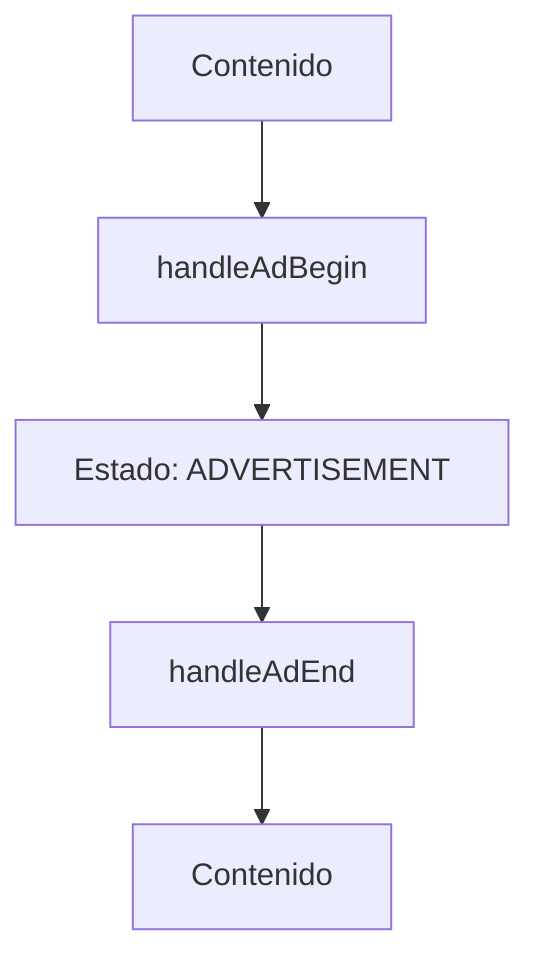
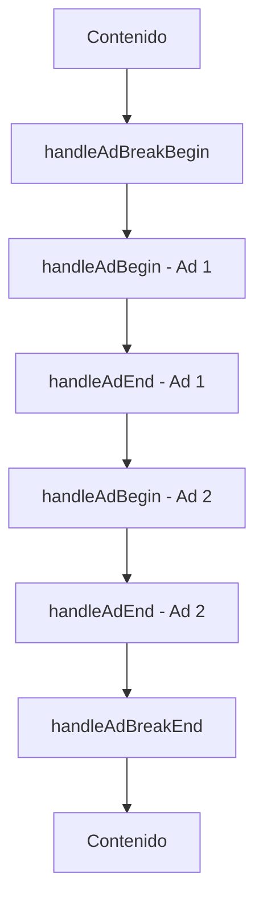
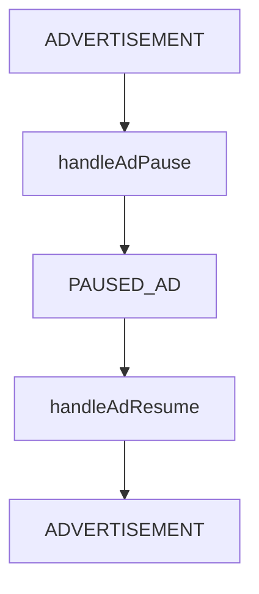

# Documentación del ComscoreAdvertisementHandler

Este documento describe el handler especializado para la gestión de anuncios (advertisements) en el sistema de tracking de ComScore.

## Descripción General

El `ComscoreAdvertisementHandler` es responsable de gestionar todos los eventos relacionados con anuncios, incluyendo anuncios individuales y bloques de anuncios (ad breaks). Maneja la transición de estados, metadatos específicos de anuncios y la sincronización con el sistema de tracking de ComScore.

## Arquitectura del Handler

| Componente | Descripción | Responsabilidad |
|------------|-------------|----------------|
| **ComscoreAdvertisementHandler** | Handler principal | Gestión completa de eventos de anuncios |
| **Advertisement State** | Estado interno | Tracking del estado actual de anuncios |
| **Metadata Management** | Gestión de metadatos | Creación y actualización de metadatos de anuncios |
| **Validation System** | Sistema de validación | Validación de parámetros y estado |

## API del Handler

### Constructor

```typescript
constructor(context: HandlerContext, stateManager: ComscoreStateManager)
```

#### Parámetros del Constructor

| Parámetro | Tipo | Descripción | Requerido |
|-----------|------|-------------|-----------|
| `context` | `HandlerContext` | Contexto compartido del handler | ✅ Sí |
| `stateManager` | `ComscoreStateManager` | Gestor de estados de ComScore | ✅ Sí |

### Eventos de Anuncios Individuales

#### handleAdBegin()

Maneja el inicio de un anuncio individual.

```typescript
handleAdBegin(params: AdBeginParams): void
```

| Parámetro | Tipo | Descripción | Requerido |
|-----------|------|-------------|-----------|
| `params` | `AdBeginParams` | Parámetros del inicio del anuncio | ✅ Sí |

**Funcionalidad:**
- ✅ Valida parámetros del anuncio
- ✅ Actualiza el estado interno a "en anuncio"
- ✅ Crea metadatos específicos del anuncio
- ✅ Configura el offset del anuncio
- ✅ Transiciona al estado de advertisement
- ✅ Registra eventos para debugging

#### handleAdEnd()

Maneja el final de un anuncio individual.

```typescript
handleAdEnd(params: AdEndParams): void
```

| Parámetro | Tipo | Descripción | Requerido |
|-----------|------|-------------|-----------|
| `params` | `AdEndParams` | Parámetros del final del anuncio | ✅ Sí |

**Funcionalidad:**
- ✅ Calcula duración del anuncio
- ✅ Limpia estado del anuncio
- ✅ Restaura metadatos originales
- ✅ Transiciona de vuelta al contenido
- ✅ Resetea offset del anuncio

#### handleAdPause()

Maneja la pausa de un anuncio.

```typescript
handleAdPause(params: AdPauseParams): void
```

| Parámetro | Tipo | Descripción | Requerido |
|-----------|------|-------------|-----------|
| `params` | `AdPauseParams` | Parámetros de la pausa del anuncio | ✅ Sí |

#### handleAdResume()

Maneja la reanudación de un anuncio.

```typescript
handleAdResume(params: AdResumeParams): void
```

| Parámetro | Tipo | Descripción | Requerido |
|-----------|------|-------------|-----------|
| `params` | `AdResumeParams` | Parámetros de la reanudación del anuncio | ✅ Sí |

#### handleAdSkip()

Maneja el salto de un anuncio.

```typescript
handleAdSkip(params: AdSkipParams): void
```

| Parámetro | Tipo | Descripción | Requerido |
|-----------|------|-------------|-----------|
| `params` | `AdSkipParams` | Parámetros del salto del anuncio | ✅ Sí |

**Funcionalidad:**
- ✅ Registra el evento de skip
- ✅ Calcula tiempo de visualización
- ✅ Limpia estado del anuncio
- ✅ Transiciona apropiadamente

### Eventos de Bloques de Anuncios (Ad Breaks)

#### handleAdBreakBegin()

Maneja el inicio de un bloque de anuncios.

```typescript
handleAdBreakBegin(params: AdBreakBeginParams): void
```

| Parámetro | Tipo | Descripción | Requerido |
|-----------|------|-------------|-----------|
| `params` | `AdBreakBeginParams` | Parámetros del inicio del ad break | ✅ Sí |

**Funcionalidad:**
- ✅ Establece ID del ad break
- ✅ Registra tiempo de inicio
- ✅ Prepara para anuncios individuales

#### handleAdBreakEnd()

Maneja el final de un bloque de anuncios.

```typescript
handleAdBreakEnd(params: AdBreakEndParams): void
```

| Parámetro | Tipo | Descripción | Requerido |
|-----------|------|-------------|-----------|
| `params` | `AdBreakEndParams` | Parámetros del final del ad break | ✅ Sí |

**Funcionalidad:**
- ✅ Calcula duración del ad break
- ✅ Limpia estado del ad break
- ✅ Transiciona de vuelta al contenido

#### handleContentResume()

Maneja la reanudación del contenido después de anuncios.

```typescript
handleContentResume(): void
```

**Funcionalidad:**
- ✅ Restaura estado del contenido
- ✅ Limpia estado de anuncios
- ✅ Transiciona a video

### Métodos de Utilidad Pública

#### getCurrentAdMetadata()

Obtiene los metadatos del anuncio actual.

```typescript
getCurrentAdMetadata(): ComscoreAdvertisementMetadata | null
```

| Retorno | Descripción |
|---------|-------------|
| `ComscoreAdvertisementMetadata \| null` | Metadatos del anuncio actual o null si no hay anuncio |

#### getCurrentAdBreakId()

Obtiene el ID del ad break actual.

```typescript
getCurrentAdBreakId(): string | null
```

| Retorno | Descripción |
|---------|-------------|
| `string \| null` | ID del ad break actual o null si no hay ad break |

#### isInAdBreak()

Verifica si actualmente se está en un ad break.

```typescript
isInAdBreak(): boolean
```

| Retorno | Descripción |
|---------|-------------|
| `boolean` | true si está en ad break, false en caso contrario |

#### getAdBreakDuration()

Obtiene la duración del ad break actual.

```typescript
getAdBreakDuration(): number
```

| Retorno | Descripción |
|---------|-------------|
| `number` | Duración en milisegundos del ad break actual |

#### setAdMetadata()

Establece metadatos personalizados para el anuncio.

```typescript
setAdMetadata(metadata: ComscoreAdvertisementMetadata): void
```

| Parámetro | Tipo | Descripción | Requerido |
|-----------|------|-------------|-----------|
| `metadata` | `ComscoreAdvertisementMetadata` | Metadatos del anuncio | ✅ Sí |

### Métodos de Validación y Diagnóstico

#### validateAdParams()

Valida los parámetros de un anuncio.

```typescript
validateAdParams(params: AdBeginParams): {
  isValid: boolean;
  errors: string[];
  warnings: string[];
}
```

| Parámetro | Tipo | Descripción | Retorno |
|-----------|------|-------------|---------|
| `params` | `AdBeginParams` | Parámetros a validar | Objeto con resultado de validación |

#### validateAdBreakState()

Valida el estado actual del ad break.

```typescript
validateAdBreakState(): {
  isValid: boolean;
  errors: string[];
  warnings: string[];
}
```

| Retorno | Descripción |
|---------|-------------|
| Objeto de validación | Contiene isValid, errors y warnings |

#### getAdStatistics()

Obtiene estadísticas del estado actual de anuncios.

```typescript
getAdStatistics(): {
  isInAd: boolean;
  isInAdBreak: boolean;
  currentAdDuration?: number;
  currentAdBreakDuration?: number;
  hasAdMetadata: boolean;
  currentAdOffset: number;
  currentState: ComscoreState;
}
```

#### forceCleanAdState()

Fuerza la limpieza del estado de anuncios.

```typescript
forceCleanAdState(): void
```

**Funcionalidad:**
- ✅ Limpia todo el estado de anuncio
- ✅ Restaura metadatos originales
- ✅ Transiciona a video si es necesario
- ✅ Resetea timers y offsets

#### exportAdSnapshot()

Exporta un snapshot completo para debugging.

```typescript
exportAdSnapshot(): {
  currentAdMetadata: ComscoreAdvertisementMetadata | null;
  currentAdBreakId: string | null;
  statistics: AdStatistics;
  validation: ValidationResult;
  timings: TimingInfo;
}
```

## Flujo de Estados de Anuncios

### 1. **Flujo Normal de Anuncio Individual**



### 2. **Flujo de Ad Break con Múltiples Anuncios**



### 3. **Flujo con Pausa de Anuncio**



## Ejemplos de Uso

### Ejemplo 1: Anuncio Individual Básico

```typescript
import { ComscoreAdvertisementHandler } from './ComscoreAdvertisementHandler';
import { AdBeginParams, AdEndParams } from '../types/AnalyticsPlugin';

// Configuración del handler
const adHandler = new ComscoreAdvertisementHandler(context, stateManager);

// Inicio del anuncio
const adBeginParams: AdBeginParams = {
  adId: 'ad_12345',
  adType: 'preroll',
  adDuration: 30000, // 30 segundos
  adPosition: 0,
  adTitle: 'Anuncio de Ejemplo',
  advertiser: 'Marca Ejemplo'
};

adHandler.handleAdBegin(adBeginParams);

// ... el anuncio se reproduce ...

// Final del anuncio
const adEndParams: AdEndParams = {
  adId: 'ad_12345',
  completed: true
};

adHandler.handleAdEnd(adEndParams);
```

### Ejemplo 2: Ad Break con Múltiples Anuncios

```typescript
// Inicio del ad break
const adBreakBeginParams: AdBreakBeginParams = {
  adBreakId: 'break_001',
  adBreakType: 'midroll',
  adBreakPosition: 300000 // 5 minutos
};

adHandler.handleAdBreakBegin(adBreakBeginParams);

// Primer anuncio
adHandler.handleAdBegin({
  adId: 'ad_001',
  adType: 'midroll',
  adDuration: 15000,
  adPosition: 300000
});

adHandler.handleAdEnd({
  adId: 'ad_001',
  completed: true
});

// Segundo anuncio
adHandler.handleAdBegin({
  adId: 'ad_002',
  adType: 'midroll',
  adDuration: 30000,
  adPosition: 300000
});

adHandler.handleAdEnd({
  adId: 'ad_002',
  completed: true
});

// Final del ad break
const adBreakEndParams: AdBreakEndParams = {
  adBreakId: 'break_001'
};

adHandler.handleAdBreakEnd(adBreakEndParams);
```

### Ejemplo 3: Manejo de Pausa y Reanudación

```typescript
// Durante la reproducción del anuncio
adHandler.handleAdPause({
  adId: 'ad_12345',
  pauseReason: 'user_action'
});

// Verificar estado
const stats = adHandler.getAdStatistics();
console.log('En anuncio:', stats.isInAd);
console.log('Estado actual:', stats.currentState);

// Reanudar anuncio
adHandler.handleAdResume({
  adId: 'ad_12345'
});
```

### Ejemplo 4: Validación y Debugging

```typescript
// Validar parámetros antes de procesar
const validation = adHandler.validateAdParams(adBeginParams);

if (!validation.isValid) {
  console.error('Parámetros inválidos:', validation.errors);
  return;
}

if (validation.warnings.length > 0) {
  console.warn('Advertencias:', validation.warnings);
}

// Procesar el anuncio
adHandler.handleAdBegin(adBeginParams);

// Obtener snapshot para debugging
const snapshot = adHandler.exportAdSnapshot();
console.log('Estado completo del anuncio:', snapshot);
```

### Ejemplo 5: Limpieza de Estado de Emergencia

```typescript
// En caso de error o estado inconsistente
try {
  adHandler.handleAdBegin(params);
} catch (error) {
  console.error('Error procesando anuncio:', error);
  
  // Forzar limpieza del estado
  adHandler.forceCleanAdState();
  
  // Verificar que el estado se limpió
  const stats = adHandler.getAdStatistics();
  console.log('Estado después de limpieza:', stats);
}
```

## Mejores Prácticas

### ✅ **Validación de Parámetros**

```typescript
// CORRECTO: Siempre validar antes de procesar
const validation = adHandler.validateAdParams(params);
if (!validation.isValid) {
  logger.error('Invalid ad parameters', validation.errors);
  return;
}
```

### ✅ **Manejo de Estados**

```typescript
// CORRECTO: Verificar estado antes de transiciones
if (adHandler.isInAdBreak()) {
  // Manejar lógica específica de ad break
  adHandler.handleAdBegin(params);
} else {
  // Iniciar ad break primero
  adHandler.handleAdBreakBegin(adBreakParams);
  adHandler.handleAdBegin(params);
}
```

### ✅ **Logging y Debugging**

```typescript
// CORRECTO: Usar logging estructurado
const snapshot = adHandler.exportAdSnapshot();
logger.debug('Ad state snapshot', {
  adId: params.adId,
  state: snapshot.statistics.currentState,
  isValid: snapshot.validation.isValid
});
```

### ✅ **Limpieza de Recursos**

```typescript
// CORRECTO: Limpiar estado en caso de error
try {
  adHandler.handleAdEnd(params);
} catch (error) {
  logger.error('Error ending ad', error);
  adHandler.forceCleanAdState();
}
```

## Consideraciones de Performance

### 🚀 **Optimizaciones**
- **Validación lazy** - Solo valida cuando es necesario
- **Caching de metadatos** - Reutiliza metadatos cuando es posible
- **Batch updates** - Agrupa actualizaciones de estado
- **Memory management** - Limpia referencias no utilizadas

### ⚠️ **Limitaciones**
- **Un anuncio activo** - Solo puede manejar un anuncio a la vez
- **Estado sincronizado** - Requiere sincronización con StateManager
- **Validación estricta** - Parámetros inválidos pueden causar fallos

## Troubleshooting

### Problemas Comunes

| Problema | Causa | Solución |
|----------|-------|----------|
| Anuncio no inicia | Parámetros inválidos | Usar `validateAdParams()` |
| Estado inconsistente | Error en transición | Usar `forceCleanAdState()` |
| Metadatos incorrectos | Configuración errónea | Verificar `getCurrentAdMetadata()` |
| Ad break no termina | Falta `handleAdBreakEnd()` | Llamar método apropiado |

### Debugging

```typescript
// Obtener información completa del estado
const snapshot = adHandler.exportAdSnapshot();
console.log('Debug info:', {
  isInAd: snapshot.statistics.isInAd,
  isInAdBreak: snapshot.statistics.isInAdBreak,
  validation: snapshot.validation,
  timings: snapshot.timings
});
```

## 🔗 Referencias

- 📚 **Tipos**: [ComscoreAdvertisementMetadata](../types/README.md)
- 🎯 **Estados**: [ComscoreState](../types/README.md)
- 🔧 **Base**: [Sistema base de handlers](./base/README.md)
- 📊 **State Manager**: [ComscoreStateManager](./README.stateManager.md)
- 📝 **Analytics**: [AnalyticsPlugin Types](../types/AnalyticsPlugin.ts)
