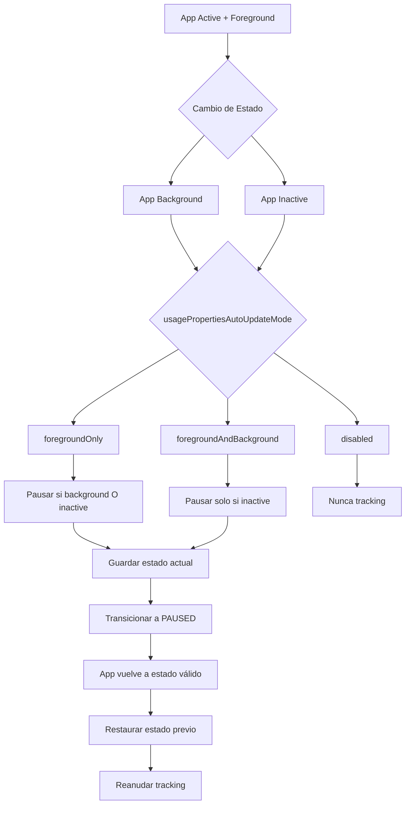

# Documentación del ComscoreApplicationHandler

Este documento describe el handler especializado para la gestión del ciclo de vida de la aplicación y su impacto en el tracking de ComScore.

## Descripción General

El `ComscoreApplicationHandler` es responsable de gestionar los cambios de estado de la aplicación (foreground/background, active/inactive) y determinar cuándo debe continuar o pausar el tracking de ComScore basándose en la configuración de `usagePropertiesAutoUpdateMode`.

## Arquitectura del Handler

| Componente | Descripción | Responsabilidad |
|------------|-------------|----------------|
| **ComscoreApplicationHandler** | Handler principal | Gestión del ciclo de vida de la aplicación |
| **Application State Tracking** | Seguimiento de estado | Monitoreo de foreground/background y active/inactive |
| **Auto Update Mode Logic** | Lógica de actualización | Determina cuándo pausar/reanudar tracking |
| **State Restoration** | Restauración de estado | Recupera el estado previo al pausar |

## Estados de la Aplicación

### Estados Monitoreados

| Estado | Descripción | Impacto en Tracking |
|--------|-------------|-------------------|
| **Foreground** | App visible para el usuario | Permite tracking (según configuración) |
| **Background** | App en segundo plano | Puede pausar tracking (según configuración) |
| **Active** | App recibiendo eventos | Permite tracking |
| **Inactive** | App no recibiendo eventos | Puede pausar tracking |

### Modos de Actualización Automática

| Modo | Descripción | Comportamiento |
|------|-------------|----------------|
| `foregroundOnly` | Solo en primer plano | Tracking activo solo cuando app está en foreground Y active |
| `foregroundAndBackground` | Primer y segundo plano | Tracking activo cuando app está active (independiente de foreground) |
| `disabled` | Deshabilitado | Nunca hace tracking automático |

## API del Handler

### Constructor

```typescript
constructor(context: HandlerContext, stateManager: ComscoreStateManager)
```

#### Parámetros del Constructor

| Parámetro | Tipo | Descripción | Requerido |
|-----------|------|-------------|-----------|
| `context` | `HandlerContext` | Contexto compartido del handler | ✅ Sí |
| `stateManager` | `ComscoreStateManager` | Gestor de estados de ComScore | ✅ Sí |

### Eventos de Ciclo de Vida

#### handleApplicationForeground()

Maneja cuando la aplicación pasa a primer plano.

```typescript
handleApplicationForeground(): void
```

**Funcionalidad:**
- ✅ Actualiza estado interno a foreground
- ✅ Evalúa si debe reanudar tracking
- ✅ Restaura estado previo si es apropiado
- ✅ Registra evento para debugging

#### handleApplicationBackground()

Maneja cuando la aplicación pasa a segundo plano.

```typescript
handleApplicationBackground(): void
```

**Funcionalidad:**
- ✅ Actualiza estado interno a background
- ✅ Evalúa si debe pausar tracking
- ✅ Guarda estado actual antes de pausar
- ✅ Transiciona a estado pausado si es necesario

#### handleApplicationActive()

Maneja cuando la aplicación se vuelve activa.

```typescript
handleApplicationActive(): void
```

**Funcionalidad:**
- ✅ Actualiza estado interno a active
- ✅ Evalúa si debe reanudar tracking
- ✅ Restaura estado previo si es apropiado

#### handleApplicationInactive()

Maneja cuando la aplicación se vuelve inactiva.

```typescript
handleApplicationInactive(): void
```

**Funcionalidad:**
- ✅ Actualiza estado interno a inactive
- ✅ Evalúa si debe pausar tracking
- ✅ Guarda estado actual antes de pausar

### Métodos de Utilidad

#### shouldTrackInCurrentApplicationState()

Determina si debe hacer tracking en el estado actual de la aplicación.

```typescript
private shouldTrackInCurrentApplicationState(): boolean
```

| Retorno | Descripción |
|---------|-------------|
| `boolean` | true si debe hacer tracking, false en caso contrario |

**Lógica de Decisión:**
- **foregroundAndBackground**: Tracking cuando `isApplicationActive === true`
- **disabled**: Nunca hace tracking (`return false`)
- **foregroundOnly** (default): Tracking cuando `isApplicationInForeground && isApplicationActive`

## Estado Interno del Handler

### Propiedades de Estado

| Propiedad | Tipo | Descripción | Valor Inicial |
|-----------|------|-------------|---------------|
| `isApplicationInForeground` | `boolean` | Si la app está en primer plano | `true` |
| `isApplicationActive` | `boolean` | Si la app está activa | `true` |
| `stateBeforeApplicationPause` | `ComscoreState \| null` | Estado antes de pausar por app | `null` |

### Flujo de Estados



## Ejemplos de Uso

### Ejemplo 1: Configuración Básica

```typescript
import { ComscoreApplicationHandler } from './ComscoreApplicationHandler';

// Configuración del handler
const appHandler = new ComscoreApplicationHandler(context, stateManager);

// Simular cambios de estado de la aplicación
// (normalmente estos eventos vienen del sistema)

// App va a segundo plano
appHandler.handleApplicationBackground();

// App vuelve a primer plano
appHandler.handleApplicationForeground();

// App se vuelve inactiva (ej: llamada telefónica)
appHandler.handleApplicationInactive();

// App se vuelve activa de nuevo
appHandler.handleApplicationActive();
```

### Ejemplo 2: Integración con React Native AppState

```typescript
import { AppState } from 'react-native';
import { ComscoreApplicationHandler } from './ComscoreApplicationHandler';

class VideoPlayerWithAppState {
  private appHandler: ComscoreApplicationHandler;
  private appStateSubscription: any;

  constructor(context: HandlerContext, stateManager: ComscoreStateManager) {
    this.appHandler = new ComscoreApplicationHandler(context, stateManager);
    this.setupAppStateListener();
  }

  private setupAppStateListener(): void {
    this.appStateSubscription = AppState.addEventListener(
      'change',
      this.handleAppStateChange.bind(this)
    );
  }

  private handleAppStateChange(nextAppState: string): void {
    console.log('App state changed to:', nextAppState);

    switch (nextAppState) {
      case 'active':
        this.appHandler.handleApplicationActive();
        this.appHandler.handleApplicationForeground();
        break;
      
      case 'background':
        this.appHandler.handleApplicationBackground();
        this.appHandler.handleApplicationInactive();
        break;
      
      case 'inactive':
        this.appHandler.handleApplicationInactive();
        break;
    }
  }

  cleanup(): void {
    if (this.appStateSubscription) {
      this.appStateSubscription.remove();
    }
  }
}
```

### Ejemplo 3: Diferentes Modos de Configuración

```typescript
// Configuración 1: Solo en primer plano (default)
const config1: ComscoreConfiguration = {
  publisherId: 'YOUR_ID',
  applicationName: 'MyApp',
  usagePropertiesAutoUpdateMode: 'foregroundOnly'
  // ... otras configuraciones
};

// Con esta configuración:
// - Tracking se pausa cuando app va a background
// - Tracking se pausa cuando app se vuelve inactive
// - Tracking se reanuda cuando app vuelve a foreground Y active

// Configuración 2: Primer plano y segundo plano
const config2: ComscoreConfiguration = {
  publisherId: 'YOUR_ID',
  applicationName: 'MyApp',
  usagePropertiesAutoUpdateMode: 'foregroundAndBackground'
  // ... otras configuraciones
};

// Con esta configuración:
// - Tracking continúa cuando app va a background
// - Tracking se pausa solo cuando app se vuelve inactive
// - Tracking se reanuda cuando app vuelve a active

// Configuración 3: Deshabilitado
const config3: ComscoreConfiguration = {
  publisherId: 'YOUR_ID',
  applicationName: 'MyApp',
  usagePropertiesAutoUpdateMode: 'disabled'
  // ... otras configuraciones
};

// Con esta configuración:
// - Nunca hace tracking automático
// - Todas las transiciones deben ser manuales
```

### Ejemplo 4: Debugging y Monitoreo

```typescript
class AppStateMonitor {
  private appHandler: ComscoreApplicationHandler;
  private logger: ComponentLogger;

  constructor(context: HandlerContext, stateManager: ComscoreStateManager) {
    this.appHandler = new ComscoreApplicationHandler(context, stateManager);
    this.logger = context.logger.forComponent('AppStateMonitor');
  }

  monitorAppState(): void {
    // Logging detallado del estado
    const currentState = this.stateManager.getCurrentState();
    const config = this.context.configuration;

    this.logger.info('App state monitoring', {
      currentComscoreState: currentState,
      usagePropertiesAutoUpdateMode: config.usagePropertiesAutoUpdateMode,
      shouldTrack: this.shouldTrackInCurrentState()
    });

    // Configurar listeners con logging
    AppState.addEventListener('change', (nextAppState) => {
      this.logger.info('App state change detected', {
        newState: nextAppState,
        timestamp: Date.now()
      });

      this.handleAppStateWithLogging(nextAppState);
    });
  }

  private handleAppStateWithLogging(nextAppState: string): void {
    const beforeState = this.stateManager.getCurrentState();

    switch (nextAppState) {
      case 'active':
        this.logger.debug('Handling app active');
        this.appHandler.handleApplicationActive();
        this.appHandler.handleApplicationForeground();
        break;
      
      case 'background':
        this.logger.debug('Handling app background');
        this.appHandler.handleApplicationBackground();
        break;
      
      case 'inactive':
        this.logger.debug('Handling app inactive');
        this.appHandler.handleApplicationInactive();
        break;
    }

    const afterState = this.stateManager.getCurrentState();

    if (beforeState !== afterState) {
      this.logger.info('ComScore state changed due to app state', {
        from: beforeState,
        to: afterState,
        appState: nextAppState
      });
    }
  }
}
```

## Comportamiento por Modo de Configuración

### foregroundOnly (Modo por Defecto)

| Estado de App | Tracking Activo | Acción |
|---------------|----------------|--------|
| Foreground + Active | ✅ Sí | Continúa/Reanuda tracking |
| Foreground + Inactive | ❌ No | Pausa tracking |
| Background + Active | ❌ No | Pausa tracking |
| Background + Inactive | ❌ No | Pausa tracking |

### foregroundAndBackground

| Estado de App | Tracking Activo | Acción |
|---------------|----------------|--------|
| Foreground + Active | ✅ Sí | Continúa/Reanuda tracking |
| Foreground + Inactive | ❌ No | Pausa tracking |
| Background + Active | ✅ Sí | Continúa tracking |
| Background + Inactive | ❌ No | Pausa tracking |

### disabled

| Estado de App | Tracking Activo | Acción |
|---------------|----------------|--------|
| Cualquier estado | ❌ No | Nunca hace tracking automático |

## Mejores Prácticas

### ✅ **Configuración Apropiada**

```typescript
// CORRECTO: Elegir modo según el tipo de contenido
const config: ComscoreConfiguration = {
  // Para contenido de audio o podcasts
  usagePropertiesAutoUpdateMode: 'foregroundAndBackground',
  
  // Para contenido de video típico
  usagePropertiesAutoUpdateMode: 'foregroundOnly',
  
  // Para control manual completo
  usagePropertiesAutoUpdateMode: 'disabled'
};
```

### ✅ **Integración con AppState**

```typescript
// CORRECTO: Manejar todos los estados de AppState
AppState.addEventListener('change', (nextAppState) => {
  switch (nextAppState) {
    case 'active':
      appHandler.handleApplicationActive();
      appHandler.handleApplicationForeground();
      break;
    case 'background':
      appHandler.handleApplicationBackground();
      appHandler.handleApplicationInactive();
      break;
    case 'inactive':
      appHandler.handleApplicationInactive();
      break;
  }
});
```

### ✅ **Logging y Debugging**

```typescript
// CORRECTO: Logging detallado para debugging
const handleAppStateChange = (nextAppState: string) => {
  logger.info('App state transition', {
    newState: nextAppState,
    currentComscoreState: stateManager.getCurrentState(),
    mode: config.usagePropertiesAutoUpdateMode
  });
  
  // ... manejar cambio de estado
};
```

### ✅ **Limpieza de Recursos**

```typescript
// CORRECTO: Limpiar listeners al desmontar
useEffect(() => {
  const subscription = AppState.addEventListener('change', handleAppStateChange);
  
  return () => {
    subscription?.remove();
  };
}, []);
```

## Consideraciones de Performance

### 🚀 **Optimizaciones**
- **Estado interno mínimo** - Solo guarda información esencial
- **Evaluación lazy** - Solo evalúa cuando hay cambios
- **Restauración eficiente** - Restaura estado previo sin re-cálculos

### ⚠️ **Limitaciones**
- **Dependiente de AppState** - Requiere integración con React Native AppState
- **Estado sincronizado** - Debe estar sincronizado con StateManager
- **Un estado previo** - Solo recuerda el último estado antes de pausar

## Troubleshooting

### Problemas Comunes

| Problema | Causa Probable | Solución |
|----------|----------------|----------|
| Tracking no se pausa en background | Modo `foregroundAndBackground` | Verificar configuración |
| Tracking no se reanuda | No se llama a método apropiado | Verificar integración con AppState |
| Estado inconsistente | Llamadas desordenadas | Seguir flujo correcto de eventos |
| Pérdida de estado | Error en restauración | Verificar que se guarda estado antes de pausar |

### Debugging

```typescript
// Verificar estado interno del handler
console.log('Application Handler State:', {
  isInForeground: appHandler.isApplicationInForeground,
  isActive: appHandler.isApplicationActive,
  stateBeforePause: appHandler.stateBeforeApplicationPause,
  shouldTrack: appHandler.shouldTrackInCurrentApplicationState()
});

// Verificar configuración
console.log('Configuration:', {
  mode: context.configuration.usagePropertiesAutoUpdateMode,
  currentState: stateManager.getCurrentState()
});
```

## Casos de Uso Específicos

### 📱 **Apps de Video**
- Usar `foregroundOnly` para pausar cuando usuario sale de la app
- Ideal para contenido que no debe reproducirse en background

### 🎵 **Apps de Audio/Música**
- Usar `foregroundAndBackground` para continuar tracking en background
- Permite tracking de podcasts o música en segundo plano

### 🎮 **Apps Interactivas**
- Usar `foregroundOnly` con manejo especial de `inactive`
- Pausar durante llamadas telefónicas o notificaciones

### 🔧 **Control Manual**
- Usar `disabled` para control completamente manual
- Implementar lógica personalizada de pausa/reanudación

## 🔗 Referencias

- 📚 **Configuración**: [ComscoreConfiguration](../types/README.md)
- 🎯 **Estados**: [ComscoreState](../types/README.md)
- 🔧 **Base**: [Sistema base de handlers](./base/README.md)
- 📊 **State Manager**: [ComscoreStateManager](./README.stateManager.md)
- 📱 **React Native**: [AppState API](https://reactnative.dev/docs/appstate)
