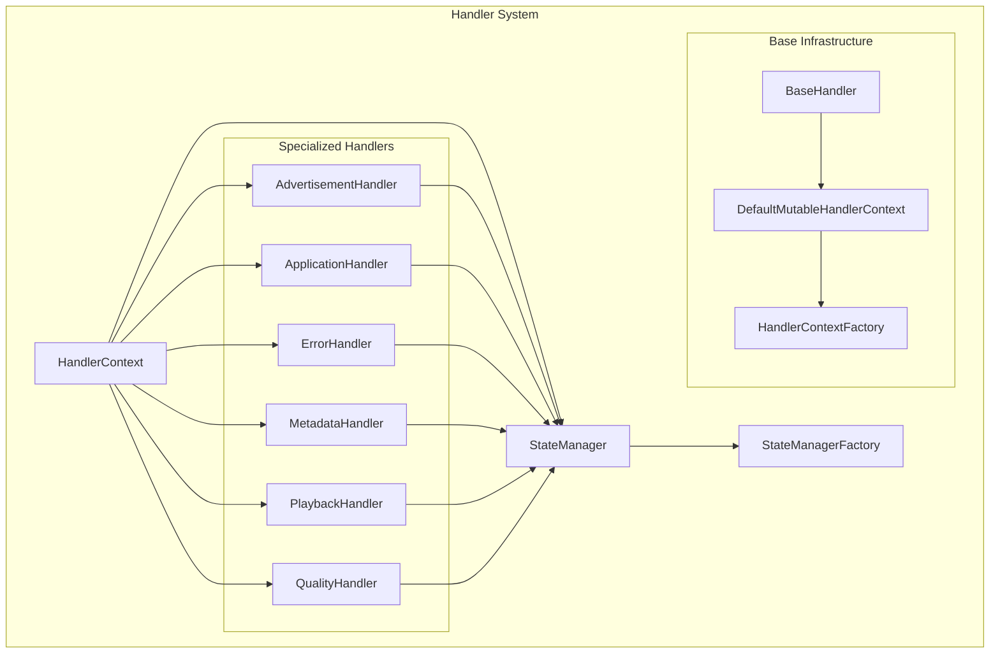
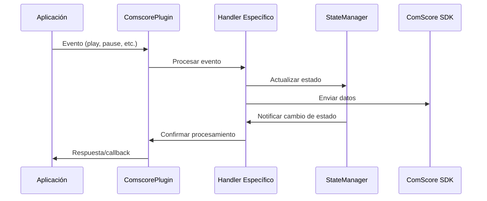

# Sistema de Handlers de ComScore

Este documento proporciona una visión general del sistema de handlers para el tracking de ComScore en React Native, incluyendo la arquitectura, componentes principales y enlaces a la documentación específica de cada handler.

## Descripción General

El sistema de handlers de ComScore implementa una arquitectura modular donde cada handler se especializa en un aspecto específico del tracking de video y anuncios. Todos los handlers comparten un contexto común y trabajan coordinadamente a través del State Manager para proporcionar un tracking preciso y eficiente.

## Arquitectura del Sistema

### Diagrama de Componentes



### Flujo de Datos



## Componentes Principales

### 📋 Tabla de Handlers

| Handler | Responsabilidad | Eventos Principales | Documentación |
|---------|----------------|-------------------|---------------|
| **Advertisement** | Gestión de anuncios | Ad begin/end, ad events | [📖 Ver documentación](./README.advertisementHandler.md) |
| **Application** | Estados de aplicación | Foreground/background | [📖 Ver documentación](./README.applicationHandler.md) |
| **Error** | Manejo de errores | Error tracking, recovery | [📖 Ver documentación](./README.errorHandler.md) |
| **Metadata** | Gestión de metadatos | Metadata changes, sync | [📖 Ver documentación](./README.metadataHandler.md) |
| **Playback** | Control de reproducción | Play, pause, seek, stop | [📖 Ver documentación](./README.playbackHandler.md) |
| **Quality** | Calidad y configuración | Quality, bitrate, audio | [📖 Ver documentación](./README.qualityHandler.md) |

### 🏗️ Infraestructura Base

| Componente | Descripción | Documentación |
|------------|-------------|---------------|
| **Base Handler** | Sistema base compartido | [📖 Ver documentación](./base/README.md) |
| **State Manager** | Gestor centralizado de estados | [📖 Ver documentación](./README.stateManager.md) |
| **State Manager Factory** | Factory para crear State Managers | [📖 Ver documentación](./README.stateManagerFactory.md) |

## Características del Sistema

### ✅ **Funcionalidades Principales**

- **🎯 Especialización**: Cada handler se enfoca en un dominio específico
- **🔄 Estado Centralizado**: State Manager coordina todos los estados
- **📡 Comunicación Eficiente**: Contexto compartido entre handlers
- **🛡️ Manejo de Errores**: Error handler dedicado con recovery
- **📊 Tracking Completo**: Cobertura de todos los eventos de video
- **🔧 Configuración Flexible**: Factory patterns para diferentes entornos

### 🚀 **Ventajas de la Arquitectura**

- **Modularidad**: Fácil mantenimiento y extensión
- **Reutilización**: Contexto y utilidades compartidas
- **Testabilidad**: Cada handler puede probarse independientemente
- **Escalabilidad**: Fácil adición de nuevos handlers
- **Performance**: Procesamiento especializado y eficiente
- **Debugging**: Logging específico por componente

## Guía de Inicio Rápido

### 1. Configuración Básica

```typescript
import { 
  ComscoreAdvertisementHandler,
  ComscoreApplicationHandler,
  ComscoreErrorHandler,
  ComscoreMetadataHandler,
  ComscorePlaybackHandler,
  ComscoreQualityHandler,
  StateManagerFactory
} from './handlers';

// Crear contexto compartido
const context: HandlerContext = {
  connector: comscoreConnector,
  metadata: initialMetadata,
  configuration: appConfiguration,
  logger: appLogger,
  instanceId: 'app-instance-001'
};

// Crear State Manager
const stateManager = StateManagerFactory.createForProduction(context);

// Inicializar handlers
const handlers = {
  advertisement: new ComscoreAdvertisementHandler(context, stateManager),
  application: new ComscoreApplicationHandler(context, stateManager),
  error: new ComscoreErrorHandler(context, stateManager),
  metadata: new ComscoreMetadataHandler(context, stateManager),
  playback: new ComscorePlaybackHandler(context, stateManager),
  quality: new ComscoreQualityHandler(context, stateManager)
};
```

### 2. Uso de Handlers

```typescript
// Ejemplo de uso coordinado de handlers
const playVideo = async (videoMetadata: ComscoreMetadata) => {
  try {
    // 1. Actualizar metadatos
    handlers.metadata.handleMetadataLoaded({ metadata: videoMetadata });
    
    // 2. Iniciar reproducción
    handlers.playback.handlePlay();
    
    // 3. Manejar calidad inicial
    handlers.quality.handleQualityChange({
      quality: '1080p',
      width: 1920,
      height: 1080,
      bitrate: 5000000
    });
    
    console.log('Video iniciado correctamente');
  } catch (error) {
    // 4. Manejar errores
    handlers.error.handleError({
      errorType: 'playback_error',
      errorMessage: error.message,
      isFatal: false
    });
  }
};
```

### 3. Manejo de Anuncios

```typescript
const playAdvertisement = (adMetadata: ComscoreMetadata) => {
  // Manejar inicio de anuncio
  handlers.advertisement.handleAdBegin({
    metadata: adMetadata,
    position: 0, // Pre-roll
    adType: 'preroll'
  });
  
  // El State Manager coordinará automáticamente la transición
  console.log('Estado actual:', stateManager.getCurrentState()); // ADVERTISEMENT
};
```

## Patrones de Uso Comunes

### 🎬 **Flujo de Reproducción Completo**

```typescript
class VideoPlayerIntegration {
  constructor(private handlers: HandlerCollection) {}
  
  async startPlayback(content: VideoContent) {
    // 1. Cargar metadatos
    this.handlers.metadata.handleMetadataLoaded({
      metadata: content.metadata
    });
    
    // 2. Verificar estado de aplicación
    if (!this.handlers.application.isApplicationActive()) {
      console.warn('App not in foreground, playback may be affected');
    }
    
    // 3. Iniciar reproducción
    this.handlers.playback.handlePlay();
    
    // 4. Configurar calidad inicial
    this.handlers.quality.handleQualityChange(content.initialQuality);
  }
  
  handleError(error: PlaybackError) {
    this.handlers.error.handleError({
      errorType: error.type,
      errorMessage: error.message,
      isFatal: error.fatal,
      errorCode: error.code
    });
  }
}
```

### 📊 **Monitoreo y Analytics**

```typescript
class HandlerMonitor {
  constructor(private handlers: HandlerCollection) {
    this.setupMonitoring();
  }
  
  private setupMonitoring() {
    // Monitorear cambios de estado
    this.handlers.stateManager.addStateChangeListener({
      onStateChanged: (from, to, reason) => {
        this.trackStateChange(from, to, reason);
      }
    });
    
    // Estadísticas periódicas
    setInterval(() => {
      this.collectStatistics();
    }, 60000); // Cada minuto
  }
  
  private collectStatistics() {
    const stats = {
      playback: this.handlers.playback.getPlaybackStatistics(),
      quality: this.handlers.quality.getQualityStatistics(),
      errors: this.handlers.error.getErrorStatistics(),
      advertisements: this.handlers.advertisement.getAdStatistics(),
      metadata: this.handlers.metadata.getMetadataStatistics()
    };
    
    console.log('Handler Statistics:', stats);
  }
}
```

## Mejores Prácticas

### ✅ **Inicialización**

```typescript
// CORRECTO: Inicializar en orden apropiado
const initializeHandlers = (context: HandlerContext) => {
  // 1. Crear State Manager primero
  const stateManager = StateManagerFactory.create(context);
  
  // 2. Crear handlers en orden de dependencia
  const errorHandler = new ComscoreErrorHandler(context, stateManager);
  const metadataHandler = new ComscoreMetadataHandler(context, stateManager);
  const applicationHandler = new ComscoreApplicationHandler(context, stateManager);
  
  // 3. Handlers de contenido
  const playbackHandler = new ComscorePlaybackHandler(context, stateManager);
  const qualityHandler = new ComscoreQualityHandler(context, stateManager);
  const advertisementHandler = new ComscoreAdvertisementHandler(context, stateManager);
  
  return {
    stateManager,
    errorHandler,
    metadataHandler,
    applicationHandler,
    playbackHandler,
    qualityHandler,
    advertisementHandler
  };
};
```

### ✅ **Manejo de Errores**

```typescript
// CORRECTO: Propagar errores a través del error handler
const safeHandlerCall = async (handlerOperation: () => void) => {
  try {
    handlerOperation();
  } catch (error) {
    handlers.error.handleError({
      errorType: 'handler_error',
      errorMessage: error.message,
      isFatal: false,
      context: 'handler_operation'
    });
  }
};
```

### ✅ **Coordinación de Estados**

```typescript
// CORRECTO: Usar State Manager para coordinación
const coordinatedTransition = (targetState: ComscoreState, reason: string) => {
  if (stateManager.canTransitionTo(targetState)) {
    // Notificar a handlers relevantes antes de la transición
    handlers.metadata.onStateTransition?.(stateManager.getCurrentState(), targetState);
    
    // Realizar transición
    switch (targetState) {
      case ComscoreState.VIDEO:
        stateManager.transitionToVideo(reason);
        break;
      case ComscoreState.ADVERTISEMENT:
        stateManager.transitionToAdvertisement(reason);
        break;
      // ... otros estados
    }
  }
};
```

## Debugging y Troubleshooting

### 🔍 **Herramientas de Debug**

```typescript
// Función de debug completa del sistema
const debugHandlerSystem = () => {
  console.log('=== HANDLER SYSTEM DEBUG ===');
  
  // Estado del State Manager
  console.log('State Manager:', stateManager.getStateSnapshot());
  
  // Estado de cada handler
  Object.entries(handlers).forEach(([name, handler]) => {
    if (handler.getDebugInfo) {
      console.log(`${name} Handler:`, handler.getDebugInfo());
    }
  });
  
  // Estadísticas generales
  console.log('System Statistics:', {
    totalErrors: handlers.error.getErrorCount(),
    currentQuality: handlers.quality.getCurrentQuality(),
    isInAd: stateManager.getInAd(),
    isBuffering: stateManager.getBuffering()
  });
  
  console.log('============================');
};
```

### ⚠️ **Problemas Comunes**

| Problema | Causa Probable | Solución |
|----------|----------------|----------|
| Estados inconsistentes | Handlers no sincronizados | Usar State Manager para coordinación |
| Eventos perdidos | Handler no inicializado | Verificar orden de inicialización |
| Performance lenta | Logging excesivo | Usar factory de producción |
| Errores no capturados | Falta error handler | Implementar manejo de errores |

## Extensibilidad

### 🔧 **Crear Handler Personalizado**

```typescript
// Ejemplo de handler personalizado
export class CustomAnalyticsHandler {
  constructor(
    private context: HandlerContext,
    private stateManager: ComscoreStateManager
  ) {
    this.logger = context.logger.forComponent('CustomAnalytics');
    this.setupStateListener();
  }
  
  private setupStateListener() {
    this.stateManager.addStateChangeListener({
      onStateChanged: (from, to, reason) => {
        this.trackCustomEvent('state_change', { from, to, reason });
      }
    });
  }
  
  trackCustomEvent(eventName: string, data: any) {
    // Implementar tracking personalizado
    this.logger.info(`Custom event: ${eventName}`, data);
  }
}
```

### 📈 **Integración con Analytics Externos**

```typescript
// Integración con sistemas de analytics externos
class ExternalAnalyticsIntegration {
  constructor(private handlers: HandlerCollection) {
    this.setupIntegrations();
  }
  
  private setupIntegrations() {
    // Google Analytics
    this.handlers.playback.onPlay = () => {
      gtag('event', 'video_play', { video_title: this.getCurrentTitle() });
    };
    
    // Adobe Analytics
    this.handlers.advertisement.onAdComplete = (adData) => {
      s.tl(true, 'o', 'ad_complete', { ad_id: adData.id });
    };
    
    // Custom analytics
    this.handlers.error.onError = (error) => {
      customAnalytics.track('video_error', error);
    };
  }
}
```

## Performance y Optimización

### 🚀 **Configuración por Entorno**

```typescript
// Configuración optimizada por entorno
const createOptimizedHandlers = (environment: 'development' | 'production') => {
  const stateManager = environment === 'production' 
    ? StateManagerFactory.createForProduction(context)
    : StateManagerFactory.createForDevelopment(context);
    
  // Configuración específica por entorno
  const config = {
    enableDetailedLogging: environment === 'development',
    enableValidation: environment === 'development',
    enableMetrics: true
  };
  
  return initializeHandlers(context, stateManager, config);
};
```

### 📊 **Métricas de Performance**

```typescript
// Sistema de métricas de performance
class HandlerPerformanceMonitor {
  private metrics = new Map<string, number[]>();
  
  measureHandler<T>(handlerName: string, operation: () => T): T {
    const start = performance.now();
    const result = operation();
    const duration = performance.now() - start;
    
    this.recordMetric(handlerName, duration);
    return result;
  }
  
  private recordMetric(handlerName: string, duration: number) {
    if (!this.metrics.has(handlerName)) {
      this.metrics.set(handlerName, []);
    }
    
    const measurements = this.metrics.get(handlerName)!;
    measurements.push(duration);
    
    // Mantener solo las últimas 100 mediciones
    if (measurements.length > 100) {
      measurements.shift();
    }
  }
  
  getPerformanceReport() {
    const report: Record<string, any> = {};
    
    this.metrics.forEach((measurements, handlerName) => {
      const avg = measurements.reduce((a, b) => a + b, 0) / measurements.length;
      const max = Math.max(...measurements);
      const min = Math.min(...measurements);
      
      report[handlerName] = { avg, max, min, count: measurements.length };
    });
    
    return report;
  }
}
```

## 📚 Documentación Detallada

### Handlers Especializados

- 📺 **[Advertisement Handler](./README.advertisementHandler.md)** - Gestión completa de anuncios
- 📱 **[Application Handler](./README.applicationHandler.md)** - Estados de aplicación y lifecycle
- ❌ **[Error Handler](./README.errorHandler.md)** - Manejo de errores y recovery
- 📋 **[Metadata Handler](./README.metadataHandler.md)** - Gestión de metadatos y sincronización
- ▶️ **[Playback Handler](./README.playbackHandler.md)** - Control de reproducción
- 🎛️ **[Quality Handler](./README.qualityHandler.md)** - Calidad, audio y subtítulos

### Infraestructura Base

- 🏗️ **[Base Handler](./base/README.md)** - Sistema base y contexto compartido
- 🔄 **[State Manager](./README.stateManager.md)** - Gestor centralizado de estados
- 🏭 **[State Manager Factory](./README.stateManagerFactory.md)** - Factory para crear State Managers

### Referencias Adicionales

- 🔗 **[Tipos y Interfaces](../types/README.md)** - Definiciones de tipos
- 📝 **[Sistema de Logging](../logger/README.md)** - Logging y debugging
- 🔌 **[Plugin Principal](../plugin/README.md)** - Integración con el plugin
- 🌐 **[API y Conectores](../api/README.md)** - Conectores y adaptadores

---

## 🎯 Resumen

El sistema de handlers de ComScore proporciona una arquitectura robusta, modular y eficiente para el tracking de video en React Native. Cada handler se especializa en un dominio específico mientras comparte un contexto común y se coordina a través del State Manager centralizado.

**Características clave:**
- ✅ Arquitectura modular y extensible
- ✅ Estado centralizado y coordinado
- ✅ Manejo robusto de errores
- ✅ Performance optimizada por entorno
- ✅ Debugging y monitoring integrados
- ✅ Documentación completa y ejemplos prácticos

Para comenzar, consulta la [Guía de Inicio Rápido](#guía-de-inicio-rápido) y la documentación específica de cada handler según tus necesidades.
