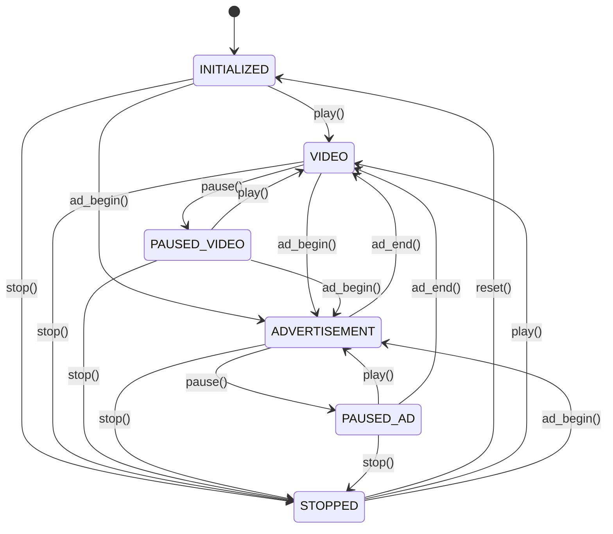

# Documentación del ComscoreStateManager

Este documento describe el gestor centralizado de estados para el sistema de tracking de ComScore, responsable de manejar todas las transiciones de estado y variables de control del plugin.

## Descripción General

El `ComscoreStateManager` es el componente central que gestiona el estado del reproductor de video y coordina las transiciones entre diferentes estados de ComScore. Implementa un sistema de máquina de estados finita con validación de transiciones, listeners de cambio de estado y capacidades de debugging.

## Arquitectura del State Manager

| Componente | Descripción | Responsabilidad |
|------------|-------------|----------------|
| **State Machine** | Máquina de estados finita | Control de transiciones válidas |
| **State Variables** | Variables de control | Gestión de buffering, ads, ended |
| **Listeners System** | Sistema de notificaciones | Comunicación de cambios de estado |
| **Validation Engine** | Motor de validación | Verificación de transiciones |
| **Snapshot System** | Sistema de snapshots | Debugging y diagnóstico |

## Estados de ComScore

### Estados Principales

| Estado | Valor | Descripción | Contexto de Uso |
|--------|-------|-------------|-----------------|
| **INITIALIZED** | `"initialized"` | Estado inicial del plugin | Configuración inicial |
| **STOPPED** | `"stopped"` | Reproducción detenida | Sin contenido activo |
| **VIDEO** | `"video"` | Reproduciendo contenido de video | Contenido principal |
| **PAUSED_VIDEO** | `"paused_video"` | Video pausado | Pausa en contenido |
| **ADVERTISEMENT** | `"advertisement"` | Reproduciendo anuncio | Contenido publicitario |
| **PAUSED_AD** | `"paused_ad"` | Anuncio pausado | Pausa en anuncio |

### Matriz de Transiciones Válidas

| Estado Origen | Estados Destino Válidos |
|---------------|-------------------------|
| **INITIALIZED** | VIDEO, ADVERTISEMENT, STOPPED |
| **STOPPED** | INITIALIZED, VIDEO, ADVERTISEMENT |
| **VIDEO** | PAUSED_VIDEO, ADVERTISEMENT, STOPPED |
| **PAUSED_VIDEO** | VIDEO, ADVERTISEMENT, STOPPED |
| **ADVERTISEMENT** | PAUSED_AD, VIDEO, STOPPED |
| **PAUSED_AD** | ADVERTISEMENT, VIDEO, STOPPED |

## API del State Manager

### Constructor

```typescript
constructor(context: HandlerContext, config: StateManagerConfig = {})
```

#### Parámetros del Constructor

| Parámetro | Tipo | Descripción | Requerido |
|-----------|------|-------------|-----------|
| `context` | `HandlerContext` | Contexto compartido del handler | ✅ Sí |
| `config` | `StateManagerConfig` | Configuración del state manager | ❌ No |

#### Configuración del State Manager

| Campo | Tipo | Descripción | Por Defecto |
|-------|------|-------------|-------------|
| `validateTransitions` | `boolean` | Validar transiciones de estado | `true` |
| `enableVerboseLogging` | `boolean` | Logging detallado | `context.configuration.debug` |
| `stateChangeListeners` | `StateChangeListener[]` | Listeners iniciales | `[]` |

### Métodos de Estado Principal

#### getCurrentState()

Obtiene el estado actual del reproductor.

```typescript
getCurrentState(): ComscoreState
```

#### setCurrentState()

Establece directamente el estado del reproductor.

```typescript
setCurrentState(state: ComscoreState, reason?: string): void
```

| Parámetro | Tipo | Descripción | Requerido |
|-----------|------|-------------|-----------|
| `state` | `ComscoreState` | Nuevo estado | ✅ Sí |
| `reason` | `string` | Razón del cambio | ❌ No |

**⚠️ Nota:** Este método bypasa la validación de transiciones.

### Métodos de Variables de Control

#### getBuffering() / setBuffering()

Gestiona el estado de buffering.

```typescript
getBuffering(): boolean
setBuffering(buffering: boolean): void
```

#### getEnded() / setEnded()

Gestiona el estado de finalización.

```typescript
getEnded(): boolean
setEnded(ended: boolean): void
```

#### getInAd() / setInAd()

Gestiona el estado de anuncio.

```typescript
getInAd(): boolean
setInAd(inAd: boolean): void
```

#### getCurrentAdOffset() / setCurrentAdOffset()

Gestiona el offset del anuncio actual.

```typescript
getCurrentAdOffset(): number
setCurrentAdOffset(offset: number): void
```

### Métodos de Transición

#### transitionToStopped()

Transiciona al estado STOPPED.

```typescript
transitionToStopped(reason?: string): void
```

**Funcionalidad:**
- ✅ Válido desde cualquier estado
- ✅ No requiere validación especial
- ✅ Registra transición en logs

#### transitionToPaused()

Transiciona al estado pausado correspondiente.

```typescript
transitionToPaused(reason?: string): void
```

**Lógica de Transición:**
- `VIDEO` → `PAUSED_VIDEO`
- `ADVERTISEMENT` → `PAUSED_AD`
- Otros estados → Log de advertencia

#### transitionToAdvertisement()

Transiciona al estado ADVERTISEMENT.

```typescript
transitionToAdvertisement(reason?: string): void
```

**Estados Válidos de Origen:**
- `PAUSED_AD`, `VIDEO`, `PAUSED_VIDEO`, `STOPPED`, `INITIALIZED`

#### transitionToVideo()

Transiciona al estado VIDEO.

```typescript
transitionToVideo(reason?: string): void
```

**Estados Válidos de Origen:**
- `PAUSED_VIDEO`, `ADVERTISEMENT`, `PAUSED_AD`, `STOPPED`, `INITIALIZED`

**Funcionalidad:**
- ✅ Valida estado de origen
- ✅ Notifica play al conector
- ✅ Registra transición

### Métodos de Validación

#### canTransitionTo()

Verifica si una transición es válida.

```typescript
canTransitionTo(targetState: ComscoreState): boolean
```

### Métodos de Gestión

#### reset()

Reinicia el state manager al estado inicial.

```typescript
reset(): void
```

**Funcionalidad:**
- ✅ Restaura estado a `INITIALIZED`
- ✅ Restaura metadatos originales del contexto
- ✅ Reinicia todas las variables de control
- ✅ Notifica cambio de estado a listeners

### Métodos de Debugging

#### getStateSnapshot()

Obtiene un snapshot completo del estado actual.

```typescript
getStateSnapshot(): StateSnapshot
```

**Estructura de StateSnapshot:**

| Campo | Tipo | Descripción |
|-------|------|-------------|
| `currentState` | `ComscoreState` | Estado actual |
| `currentContentMetadata` | `ComscoreMetadata \| null` | Metadatos actuales |
| `buffering` | `boolean` | Estado de buffering |
| `ended` | `boolean` | Si ha terminado |
| `inAd` | `boolean` | Si está en anuncio |
| `currentAdOffset` | `number` | Offset del anuncio |
| `instanceId` | `string` | ID de la instancia |
| `timestamp` | `number` | Timestamp del snapshot |

## Interfaces y Tipos

### StateChangeListener

```typescript
interface StateChangeListener {
  onStateChanged(
    fromState: ComscoreState,
    toState: ComscoreState,
    reason?: string
  ): void;
}
```

### StateManagerConfig

```typescript
interface StateManagerConfig {
  validateTransitions?: boolean;
  enableVerboseLogging?: boolean;
  stateChangeListeners?: StateChangeListener[];
}
```

## Flujo de Estados

### Diagrama de Estados



## Ejemplos de Uso

### Ejemplo 1: Configuración Básica

```typescript
import { ComscoreStateManager } from './ComscoreStateManager';

// Configuración básica
const stateManager = new ComscoreStateManager(context, {
  validateTransitions: true,
  enableVerboseLogging: true
});

// Verificar estado inicial
console.log('Estado inicial:', stateManager.getCurrentState()); // INITIALIZED

// Transición a video
stateManager.transitionToVideo('user_initiated_play');
console.log('Estado actual:', stateManager.getCurrentState()); // VIDEO
```

### Ejemplo 2: Listener de Cambios de Estado

```typescript
// Implementar listener personalizado
class VideoPlayerStateListener {
  onStateChanged(fromState: ComscoreState, toState: ComscoreState, reason?: string) {
    console.log(`Estado cambió: ${fromState} → ${toState}`, { reason });
    
    // Actualizar UI según el estado
    this.updatePlayerUI(toState);
  }
  
  private updatePlayerUI(state: ComscoreState) {
    const playButton = document.getElementById('play-button');
    const pauseButton = document.getElementById('pause-button');
    
    switch (state) {
      case ComscoreState.VIDEO:
      case ComscoreState.ADVERTISEMENT:
        playButton.style.display = 'none';
        pauseButton.style.display = 'block';
        break;
        
      case ComscoreState.PAUSED_VIDEO:
      case ComscoreState.PAUSED_AD:
        playButton.style.display = 'block';
        pauseButton.style.display = 'none';
        break;
    }
  }
}

// Registrar listener
const listener = new VideoPlayerStateListener();
stateManager.addStateChangeListener(listener);
```

### Ejemplo 3: Manejo de Anuncios

```typescript
// Flujo completo de manejo de anuncios
class AdManager {
  constructor(private stateManager: ComscoreStateManager) {}
  
  async playPreRollAd(adMetadata: ComscoreMetadata) {
    console.log('Iniciando pre-roll ad');
    
    // Configurar metadatos del anuncio
    this.stateManager.setCurrentContentMetadata(adMetadata);
    
    // Transicionar a anuncio
    this.stateManager.transitionToAdvertisement('preroll_start');
    this.stateManager.setCurrentAdOffset(-1.0); // Pre-roll
    
    // Simular reproducción del anuncio
    await this.simulateAdPlayback();
    
    // Finalizar anuncio y volver al contenido
    this.finishAd();
  }
  
  private async simulateAdPlayback(): Promise<void> {
    return new Promise(resolve => {
      setTimeout(() => {
        console.log('Anuncio completado');
        resolve();
      }, 5000); // 5 segundos de anuncio
    });
  }
  
  private finishAd() {
    // Restaurar metadatos del contenido principal
    const originalMetadata = context.metadata;
    this.stateManager.setCurrentContentMetadata(originalMetadata);
    
    // Volver al video principal
    this.stateManager.transitionToVideo('ad_complete');
    this.stateManager.setInAd(false);
    this.stateManager.setCurrentAdOffset(0.0);
  }
}
```

### Ejemplo 4: Debugging y Validación

```typescript
// Sistema de debugging
class StateDebugger {
  constructor(private stateManager: ComscoreStateManager) {}
  
  debugStateInfo() {
    const snapshot = this.stateManager.getStateSnapshot();
    
    console.log('=== STATE MANAGER DEBUG INFO ===');
    console.log('Current State:', snapshot.currentState);
    console.log('Buffering:', snapshot.buffering);
    console.log('Ended:', snapshot.ended);
    console.log('In Ad:', snapshot.inAd);
    console.log('Ad Offset:', snapshot.currentAdOffset);
    console.log('Is Playing:', this.stateManager.isInPlayingState());
    console.log('Is Paused:', this.stateManager.isInPausedState());
    console.log('Is Active:', this.stateManager.isInActiveState());
    console.log('================================');
  }
  
  validateTransition(targetState: ComscoreState): boolean {
    const canTransition = this.stateManager.canTransitionTo(targetState);
    
    if (!canTransition) {
      console.error('Transición inválida:', {
        from: this.stateManager.getCurrentState(),
        to: targetState
      });
    }
    
    return canTransition;
  }
}

// Uso del debugger
const debugger = new StateDebugger(stateManager);

// Debug periódico
setInterval(() => {
  debugger.debugStateInfo();
}, 30000); // Cada 30 segundos

// Validar antes de transiciones
if (debugger.validateTransition(ComscoreState.VIDEO)) {
  stateManager.transitionToVideo('validated_play');
}
```

## Mejores Prácticas

### ✅ **Validación de Transiciones**

```typescript
// CORRECTO: Validar transiciones antes de ejecutar
const safeTransition = (targetState: ComscoreState, reason: string) => {
  if (stateManager.canTransitionTo(targetState)) {
    switch (targetState) {
      case ComscoreState.VIDEO:
        stateManager.transitionToVideo(reason);
        break;
      case ComscoreState.ADVERTISEMENT:
        stateManager.transitionToAdvertisement(reason);
        break;
      // ... otros estados
    }
  } else {
    console.warn('Transición no válida ignorada');
  }
};
```

### ✅ **Manejo de Listeners**

```typescript
// CORRECTO: Limpiar listeners al destruir
class ComponentWithStateListener {
  private listener: StateChangeListener;
  
  constructor(private stateManager: ComscoreStateManager) {
    this.listener = {
      onStateChanged: this.handleStateChange.bind(this)
    };
    
    this.stateManager.addStateChangeListener(this.listener);
  }
  
  destroy() {
    this.stateManager.removeStateChangeListener(this.listener);
  }
  
  private handleStateChange(from: ComscoreState, to: ComscoreState) {
    // Manejar cambio de estado
  }
}
```

### ✅ **Gestión de Metadatos**

```typescript
// CORRECTO: Actualizar metadatos antes de transiciones importantes
const playContent = (contentMetadata: ComscoreMetadata) => {
  // Primero actualizar metadatos
  stateManager.setCurrentContentMetadata(contentMetadata);
  
  // Luego transicionar
  stateManager.transitionToVideo('content_start');
};
```

## Consideraciones de Performance

### 🚀 **Optimizaciones**
- **Validación opcional** - Puede deshabilitarse en producción
- **Listeners eficientes** - Notificación directa sin overhead
- **Estado inmutable** - Snapshots no afectan estado interno
- **Logging condicional** - Solo en modo debug

### ⚠️ **Limitaciones**
- **Un estado por instancia** - No mantiene historial de estados
- **Listeners síncronos** - Pueden bloquear transiciones
- **Validación estática** - Reglas de transición no son configurables

## Troubleshooting

### Problemas Comunes

| Problema | Causa Probable | Solución |
|----------|----------------|----------|
| Transición ignorada | Estado no válido | Verificar `canTransitionTo()` |
| Listeners no se ejecutan | Error en listener | Manejar excepciones en listeners |
| Estado inconsistente | Transición directa | Usar métodos de transición apropiados |
| Metadatos no se actualizan | Contexto no sincronizado | Verificar `setCurrentContentMetadata()` |

### Debugging

```typescript
// Información completa del estado
const debugState = () => {
  const snapshot = stateManager.getStateSnapshot();
  console.log('State Debug:', snapshot);
  
  // Verificar capacidades
  console.log('Can transition to VIDEO:', stateManager.canTransitionTo(ComscoreState.VIDEO));
  console.log('Can transition to AD:', stateManager.canTransitionTo(ComscoreState.ADVERTISEMENT));
};
```

## 🔗 Referencias

- 📚 **Tipos**: [Handler Types](./types/index.ts)
- 🎯 **Estados**: [ComScore States](../types/ComscoreState.ts)
- 🔧 **Base**: [Sistema base de handlers](./base/README.md)
- 📝 **Logging**: [Sistema de logging](../logger/README.md)
- 🏗️ **Factory**: [State Manager Factory](./README.stateManagerFactory.md)
